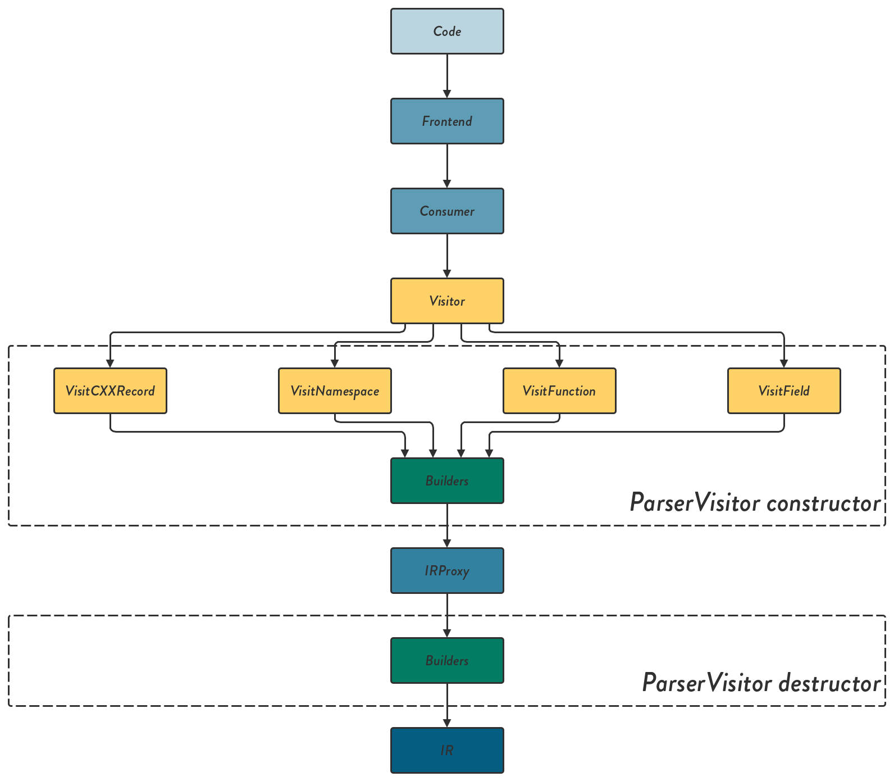

# Parser #

Parser is the library for converting a header file of `C++` to the intermediate representation declared in the library `IR::IR`

## Installation ##

Use `FetchContent` in your `CMakeLists.txt` as follows:

```cmake
include(FetchContent)
FetchContent_Declare(
  Parser
  GIT_REPOSITORY git@github.com:srydell/Parser.git
  GIT_TAG master)

# Downloads and makes the parser library available
FetchContent_MakeAvailable(Parser)
```

## Usage ##

Link against it in your `CMakeLists.txt` as follows:

```cmake
target_link_libraries(your_target PRIVATE Parser)
```

And you should get all the necessary components of the library.


## Architecture ##



The architecture roughly follows the figure above. The `code` is supplied by the user, and passes through a `Frondend` and a `Consumer`. Both of these are entry points from where various clang tools can be built. Since we are mainly interested in the actual `AST` ([Abstract Syntax Tree](https://en.wikipedia.org/wiki/Abstract_syntax_tree)) of the code, we must use the third and last entry point, the `Visitor`. The `Visitor` is a class with a set of functions, all beginning with `Visit` followed by what that function should be called on. E.g. `VisitNamespaceDecl` gets called whenever the `Visitor` encounters a `C++` `namespace` within the `AST`. The function will then take the `AST` node as input.

Whenever an appropriate `AST` node is found, it is passed on to a `Builder`, which converts it to `IRProxy`. `IRProxy` (or `Intermediate Represantation Proxy`) is continuously built by the `Visitor` functions with as much information as possible from each node. When all the `code` has been examined, the `Visitor` will run its destructor, which will be used to take all the `IRProxy` and put it through another set of builders, which will produce the final `IR`.

### Good to know ###

* The `AST` nodes (or clang `decl`s) do not live until the `Visitor` is destructed, so they cannot be a part of the `IRProxy`.

* The clang `decl`s use an inheritance scheme, where you can choose to visit more "specialized" `decl`, or even the base (simply `decl`). E.g. `FunctionDecl` covers all functions, but `CXXMethodDecl` is a class function.
