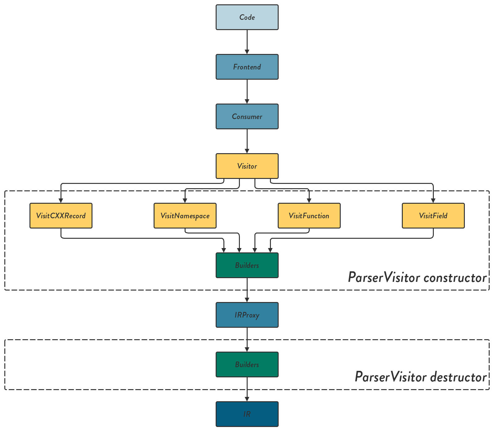

 

# Parser #

Parser is the library for converting a header file of `C++` to the intermediate representation declared in the library `IR::IR`

## Installation ##

Use `FetchContent` in your `CMakeLists.txt` as follows:

```cmake
include(FetchContent)
FetchContent_Declare(
  Parser
  GIT_REPOSITORY git@github.com:srydell/Parser.git
  GIT_TAG master)

# Downloads and makes the parser library available
FetchContent_MakeAvailable(Parser)

# Link it to your target
target_link_libraries(your_target PRIVATE Tolc::Parser)
```

And you should get all the necessary components of the library.


## Usage ##

`Parser` only exposes one header file, `Parser/Parse.h`, which can be used as:

```cpp
#include <Parser/Parse.hpp>
#include <iostream>

int main() {
    // Get a IR::Namespace representing the global namespace
    auto globalNamespace = Parser::parseString(R"(
int f() {
    return 5;
}
    )");

    if (globalNamespace) {
        // Will return "f"
        std::cout << globalNamespace.m_functions[0].m_name << '\n';
    }
}
```

## Architecture ##



The architecture roughly follows the figure above. The `code` is supplied by the user, and passes through a `Frontend` and a `Consumer`. Both of these are entry points from where various clang tools can be built. Since we are mainly interested in the actual `AST` ([Abstract Syntax Tree](https://en.wikipedia.org/wiki/Abstract_syntax_tree)) of the code, we must use the third and last entry point, the `Visitor`. The `Visitor` is a class with a set of functions, all beginning with `Visit` followed by what that function should be called on. E.g. `VisitNamespaceDecl` gets called whenever the `Visitor` encounters a `C++` `namespace` within the `AST`. The function will then take the `AST` node as input.

Whenever an appropriate `AST` node is found, it is passed on to a `Builder`, which converts it to `IRProxy`. `IRProxy` (or `Intermediate Represantation Proxy`) is continuously built by the `Visitor` functions with as much information as possible from each node. When all the `code` has been examined, the `Visitor` will run its destructor, which will be used to take all the `IRProxy` and put it through another set of builders, which will produce the final `IR`.

### Good to know ###

* The `AST` nodes (or clang `decl`s) do not live until the `Visitor` is destructed, so they cannot be a part of the `IRProxy`.

* The clang `decl`s use an inheritance scheme, where you can choose to visit more "specialized" `decl`, or even the base (simply `decl`). E.g. `FunctionDecl` covers all functions, but `CXXMethodDecl` is a class function.

### Conan library does not find headers ###

Example:

```shell
In file included from /home/simon/.conan/data/fmt/6.2.0/_/_/build/9aea1b1a46cc502b3591eafb492153938cec535f/source_subfolder/src/os.cc:13:
/home/simon/.conan/data/fmt/6.2.0/_/_/build/9aea1b1a46cc502b3591eafb492153938cec535f/source_subfolder/include/fmt/os.h:16:10: fatal error: 'cerrno' file not found
#include <cerrno>
         ^~~~~~~~
	 1 error generated.
```

This needs some debugging. To see what header directories are being searched, we need to know the compilation step; go to the build directory, in this case:

```shell
$ cd /home/simon/.conan/data/fmt/6.2.0/_/_/build/9aea1b1a46cc502b3591eafb492153938cec535f/build_subfolder/source_subfolder
```

In this case the library is built with `make`, so;

```shell
$ VERBOSE=1 make
```

The output is large, but find the offending command. In this case:

```shell
$ cd /home/simon/.conan/data/fmt/6.2.0/_/_/build/9aea1b1a46cc502b3591eafb492153938cec535f/build_subfolder/source_subfolder && /usr/bin/clang++  -I/home/simon/.conan/data/fmt/6.2.0/_/_/build/9aea1b1a46cc502b3591eafb492153938cec535f/source_subfolder/include -m64 -stdlib=libc++ -g  -fPIC -std=gnu++11 -o CMakeFiles/fmt.dir/src/os.cc.o -c /home/simon/.conan/data/fmt/6.2.0/_/_/build/9aea1b1a46cc502b3591eafb492153938cec535f/source_subfolder/src/os.cc
```

Add the verbose flag `-v` at the end to get what directories are searched;

```shell
$ <build_command> -v
...
#include "..." search starts here:
#include <...> search starts here:
  /home/simon/.conan/data/fmt/6.2.0/_/_/build/9aea1b1a46cc502b3591eafb492153938cec535f/source_subfolder/include
  /usr/local/include
  /usr/lib/clang/10.0.1/include
  /usr/include
  End of search list.
<previously shown error>
```

Search these directories for the missing header, hopefully you will not find it. In this case the offender is actually that we are using `-stdlib=libc++`, and it is not installed on my machine.
